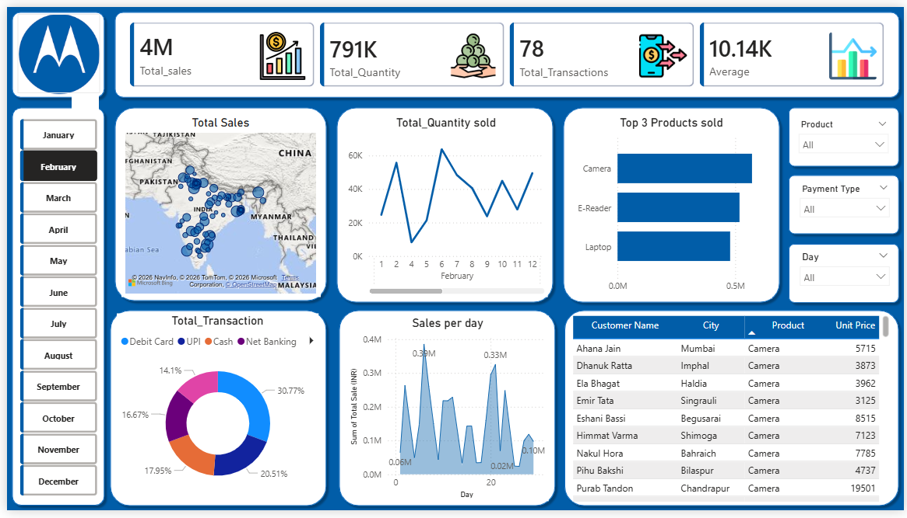

# Sales Performance Dashboard (Power BI)

## 📊 Overview
This project analyzes sales data to identify trends, top products, and customer behavior.

## 🛠 Tools Used
- Power BI
- DAX (SUM, SUMX, COUNTROWS)

## 📸 Dashboard Preview

## 🧮 DAX Measures Used
- SUM → Total Quantity
- SUMX → Total Sales (Quantity × Price)
- COUNTROWS → Total Transactions

## 📌 Key Insights
- Peak sales observed in certain months
- Cameras are top-selling products
- UPI is the most used payment method
