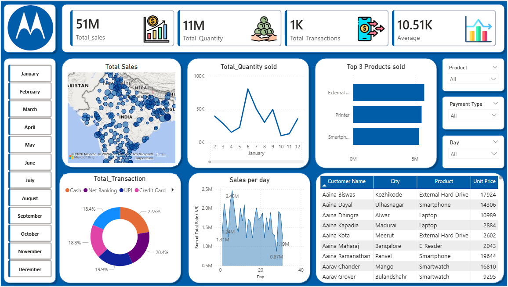

# 📊 Sales Performance Dashboard (Power BI)

## 📌 Project Overview
This project analyzes sales data to uncover trends, product performance, and customer behavior using Power BI.

## 🚀 Key Features
- KPI tracking (Total Sales, Quantity, Transactions)
- Sales trend analysis over time
- Top-performing products
- Payment method insights
- Interactive filters and slicers

## 🛠 Tools Used
- Power BI
- DAX (SUM, SUMX, COUNTROWS)
- Excel / CSV

## 🧮 DAX Measures Used
- **SUM** → Total Quantity
- **SUMX** → Total Sales (Quantity × Unit Price)
- **COUNTROWS** → Total Transactions

## 📸 Dashboard Preview

## 📊 Key Insights
- Sales peaked during specific months indicating seasonal trends
- Cameras are the top-performing product category
- UPI is the most preferred payment method
